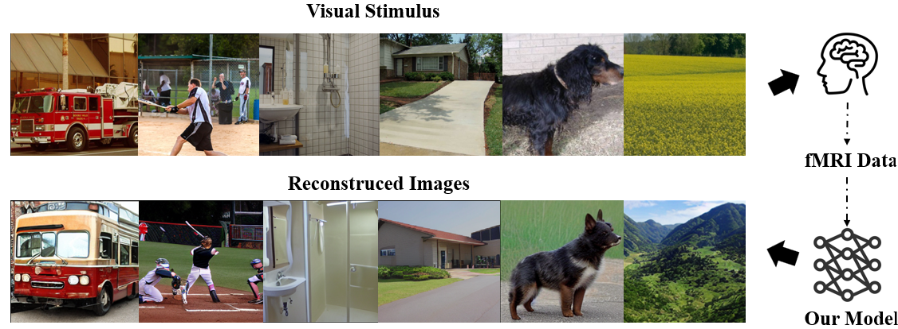
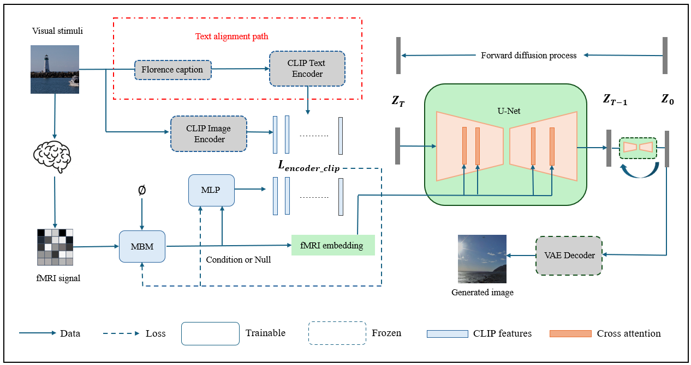
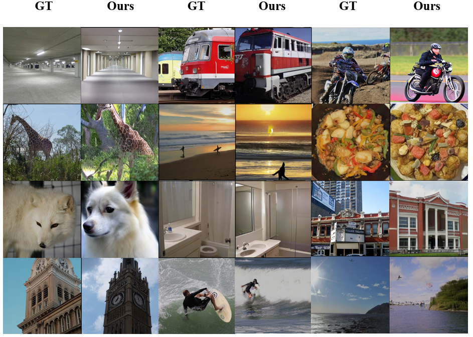

# NeuroLens: Brain Encoding and Decoding of Vision

<!-- Badges -->


<!-- Teaser Figure -->
<p align="center">
  
</p>
<p align="center">
  <em>Brain decoding and visual reconstruction from fMRI data by our model.</em>
</p>

---

## Abstract

<!-- Paste your final, polished abstract here. -->
Reconstructing visual experiences from brain activity remains a major challenge in neuroscience and Brain-Computer Interface (BCI) research, particularly due to the noisy and low-resolution nature of fMRI signals. Our framework addresses this challenge by leveraging a powerful pre-trained diffusion model as the generative backbone. To guide the generation process, we extract features from fMRI signals using a Masked Brain Modeling (MBM), alignalign them with a visual-semantic space provided by Contrastive Language-Image Pre-training (CLIP), and enhance generative control using a Classifier-Free Guidance (CFG) mechanism. The mechanism works by jointly training the model on fMRI conditions and null inputs, thereby achieving an amplified guidance signal during inference, enforcing stricter adherence to the fMRI features. Compared to previous state-of-the-art method, our model achieves significant improvements, with a 23% increase in top-1 semantic classification accuracy and achieves superior results on visual fidelity metrics including PCC and SSIM. To further understand the contributions of individual components, we also conducted an ablation study that systematically evaluated different semantic alignment strategies and the role of generative control.


---

## Framework

<!-- Add your final model architecture diagram here. -->
<p align="center">
  
</p>

---

## Getting Started

### 1. Environment Setup

We recommend using Conda for environment management.

```bash
# 1. Clone this repository
git clone https://github.com/yasklop/NeuroLens-Brain-Encoding-and-Decoding.git

cd NeuroLens-Brain-Encoding-and-Decoding

# 2. Create and activate the Conda environment
conda env create -f environment.yml
conda activate erp
```


### 2. Dataset Preparation
The preprocessed **BOLD5000** and **Generic Object Decoding (GOD)** datasets, as well as the pre-trained **MBM encoder checkpoint**, can be downloaded from the official MinD-Vis FigShare repository:

* **[MinD-Vis Data and Models on FigShare](https://figshare.com/s/94cd778e6afafb00946e)**

After downloading, please organize the files into the following directory structure:

**Data Structure:**
```
./data/
├── Kamitani/
│   └── npz/
│       ├── sbj_1.npz
│       ├── ... (sbj_2 to sbj_5)
│       ├── images_256.npz
│       └── ... (label files)
└── BOLD5000/
    ├── BOLD5000_GLMsingle_ROI_betas/
    │   └── py/
    │       ├── CSI1_GLMbetas-TYPED-FITHRF-GLMDENOISE-RR_allses_LHEarlyVis.npy
    │       └── ...
    └── BOLD5000_Stimuli/
        └── ...
```

**Pre-trained Checkpoints Structure:**
```
./pretrains/
├── GOD/
│   ├── fmri_encoder.pth
│   └── finetuned.pth
└── BOLD5000/
    ├── fmri_encoder.pth
    └── finetuned.pth
```

### 3. Training

Before starting, log in to your Weights & Biases account for experiment tracking:
```bash
wandb login
```

#### Training the Final Model (Encoder-Level alignment + CFG)

To train our best-performing model, simply run the main training script. You can specify the guidance scale using the `--cfg_scale` argument.
```bash
python stageB_SD_finetuned.py --dataset "BOLD5000" --cfg_scale 3.0 # or dataset "GOD"
```

#### Running Ablation Studies

To replicate our ablation studies, you will need to manually modify the import statement at the top of the `stageB_SD_finetuned.py` script to switch between different model architectures.

Open `stageB_SD_finetuned.py` and locate the following line:
```python
from dc_ldm.sd15_for_fmri_clipA import fSD15
```

Modify this import according to the model you wish to train:

* **Model for CFG only:**
    ```python
    from dc_ldm.sd15_for_fmri import fSD15 
    ```
    
* **Model without CFG:**
    ```python
    from dc_ldm_.sd15_for_fmri_noCFG import fSD15
    ```

* **Model For Generator-Level Alignment:**
    ```python
    from dc_ldm_.sd15_for_fmri_clipB import fSD15
    ```


After modifying the import, run the training script as usual. If you run the model with out CFG, set the scale to 0.0.

### 4. Inference and Evaluation
After the 150th epoch, a full validation is performed every 25 epochs. This includes generating images for the entire test set and calculating all evaluation metrics. You can monitor the progress on your Weights & Biases dashboard.

**Training Metrics Logged to Wandb:**
```
train/clip_loss
train/loss_simple
train/loss
train/generated_grid
```

**Validation Metrics Logged to Wandb:**
```
val/top-1-class (max)
val/top-1-class
val/ssim
val/psm
val/pcc
val/mse
val/loss
val/generated_images
```
---
<!-- Add your final model architecture diagram here. -->
<p align="center">
  
</p>

## Acknowledgements

This work is built upon the codebases of MinD-Vis (https://github.com/zjc062/mind-vis) and [Hugging Face Diffusers](https://github.com/huggingface/diffusers). We thank the creators of the BOLD5000 and GOD datasets for their contributions to the community.
